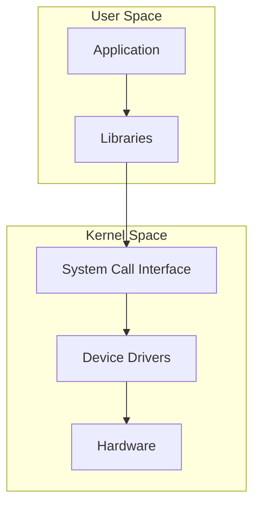
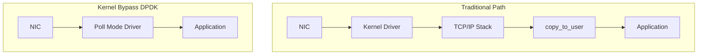
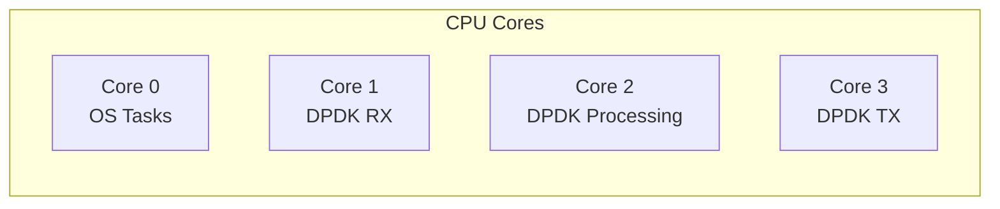
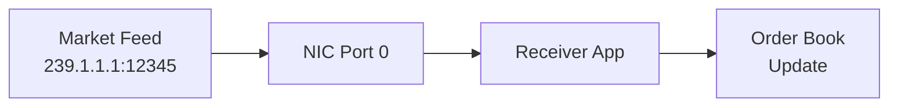
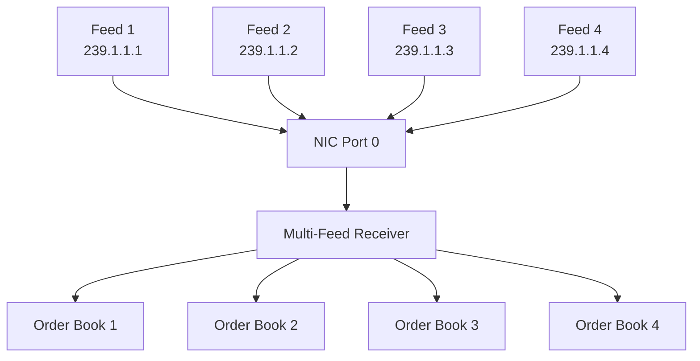
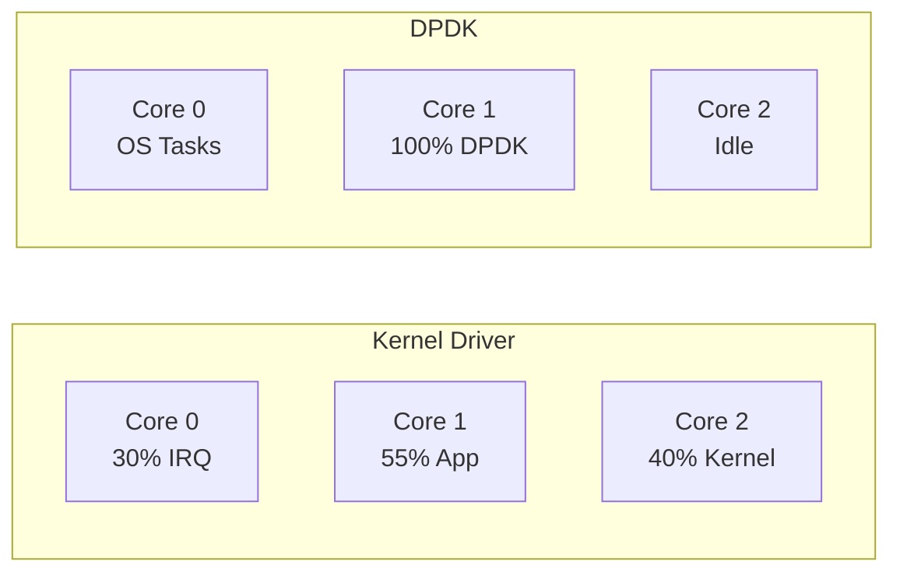

# Linux Drivers and Kernel-Bypass Networking for HFT

**An Intern's Journey into Low-Latency Systems**

**Note**: Our firm uses Solarflare ef_vi, but this presentation uses DPDK as a teaching tool since it's more accessible without specialized hardware. The concepts are directly transferable.

---

## Part 1: Introduction to Linux Drivers

---

### Slide 1: Kernel Architecture Overview

**User Space vs Kernel Space**



- **User Space**: Where applications run (non-privileged)
- **Kernel Space**: Where OS and drivers run (privileged)
- **System Calls**: Interface between user and kernel space

---

### Slide 2: System Call Flow

**What happens when an application reads data?**

1. Application calls `read(fd, buf, count)`
2. User space → Kernel space transition (context switch)
3. Kernel validates parameters
4. Driver reads from hardware
5. Data copied from kernel space → user space
6. Kernel space → User space transition
7. Application receives data

**Cost**: Each transition takes time (microseconds matter!)

---

### Slide 3: Character Device Driver Basics

**What is a Character Device?**

- Provides serial access to data (byte-by-byte)
- Accessed through standard file operations
- Examples: `/dev/null`, `/dev/random`, `/dev/tty`

**Key Concepts:**
- **Major Number**: Identifies the driver
- **Minor Number**: Identifies the specific device
- **File Operations**: read, write, open, close, ioctl

---

### Slide 4: Character Driver Code Structure

**Minimal Character Driver Example**

```c
#include <linux/module.h>
#include <linux/fs.h>
#include <linux/uaccess.h>

static int major_number;
static char device_buffer[256];

static int device_open(struct inode *inode, struct file *file) {
    printk(KERN_INFO "Device opened\n");
    return 0;
}

static ssize_t device_read(struct file *file, char __user *buffer,
                           size_t len, loff_t *offset) {
    int bytes = min(len, sizeof(device_buffer));
    if (copy_to_user(buffer, device_buffer, bytes))
        return -EFAULT;
    return bytes;
}
```

---

### Slide 5: Character Driver Registration

**Loading and Using the Driver**

```c
static struct file_operations fops = {
    .owner = THIS_MODULE,
    .open = device_open,
    .read = device_read,
    .write = device_write,
    .release = device_release,
};

static int __init driver_init(void) {
    major_number = register_chrdev(0, "mydevice", &fops);
    printk(KERN_INFO "Registered with major number %d\n", major_number);
    return 0;
}

module_init(driver_init);
module_exit(driver_exit);
```

**Building**: `make`, `insmod mydriver.ko`
**Using**: `cat /dev/mydevice`, `echo "data" > /dev/mydevice`

---

### Slide 6: Network Driver Essentials

**From Character Devices to Network Devices**

Key differences:
- Network devices don't have device files in `/dev`
- Accessed through network stack (sockets)
- Handle packets, not byte streams
- More complex: interrupts (`send`/`receive`), DMA (AF_XDP), queues (io_uring)

**Core Structure: `struct net_device`**
- Represents a network interface
- Contains device operations via `net_device_ops`
- Manages TX/RX queues

---

### Slide 7: Real Network Driver Example - e1000

**Intel e1000 Gigabit Ethernet Driver** (from Linux kernel)

```c
static const struct net_device_ops e1000_netdev_ops = {
    .ndo_open           = e1000_open,           // Bring interface up
    .ndo_stop           = e1000_close,          // Bring interface down
    .ndo_start_xmit     = e1000_xmit_frame,     // Transmit packet
    .ndo_set_rx_mode    = e1000_set_rx_mode,    // Set RX mode (promisc, etc.)
    .ndo_set_mac_address = e1000_set_mac,       // Change MAC address
    .ndo_tx_timeout     = e1000_tx_timeout,     // Handle TX timeout
    .ndo_change_mtu     = e1000_change_mtu,     // Change MTU
    .ndo_eth_ioctl      = e1000_ioctl,          // ioctl operations
    .ndo_validate_addr  = eth_validate_addr,    // Validate MAC
    .ndo_vlan_rx_add_vid = e1000_vlan_rx_add_vid,   // VLAN support
    .ndo_vlan_rx_kill_vid = e1000_vlan_rx_kill_vid,
#ifdef CONFIG_NET_POLL_CONTROLLER
    .ndo_poll_controller = e1000_netpoll,       // Netpoll support
#endif
    .ndo_fix_features   = e1000_fix_features,   // Feature negotiation
    .ndo_set_features   = e1000_set_features,
};
```

**Key Operations:**
- `ndo_open/stop`: Interface up/down (like `ifconfig eth0 up`)
- `ndo_start_xmit`: Core TX function - called for every outgoing packet
- `ndo_set_rx_mode`: Configure multicast, promiscuous mode

**Where's the RX handler?** 🤔
- **Not in net_device_ops!** RX is handled differently
- RX uses interrupts + NAPI polling (registered separately)
- TX is synchronous (kernel calls `ndo_start_xmit`)
- RX is asynchronous (hardware triggers interrupt → driver pushes to kernel)

---

### Slide 8: Where is the RX Handler?

**Why RX is Not in net_device_ops**

**TX Path (Synchronous):**
```c
// Kernel initiates, driver responds
Application → socket → kernel → ndo_start_xmit() → NIC
```

**RX Path (Asynchronous):**
```c
// Hardware initiates, driver receives
NIC (DMA) → hardirq → napi_schedule() → softirq (NAPI poll) → 
sk_buff → netif_receive_skb() → TCP/IP → socket queue → 
copy_to_user() → Application
```

**e1000 RX Setup (in e1000_open):**
```c
// 1. Register interrupt handler
request_irq(adapter->pdev->irq, e1000_intr, IRQF_SHARED, 
            netdev->name, netdev);

// 2. Register NAPI poll function
netif_napi_add(netdev, &adapter->napi, e1000_clean, 64);

// 3. When interrupt fires:
static irqreturn_t e1000_intr(int irq, void *data) {
    // Schedule NAPI polling
    napi_schedule(&adapter->napi);
}

// 4. NAPI poll function receives packets:
static int e1000_clean(struct napi_struct *napi, int budget) {
    // Read packets from RX ring
    // Call netif_receive_skb() to pass to kernel
}
```

**Key Point**: RX is interrupt-driven, not function-call driven like TX

**Why Two Steps (hardirq → softirq)?**
- **hardirq**: Must be fast! Just acknowledge interrupt and schedule work
- **softirq**: Does the real work (packet processing) without blocking other interrupts
- This is faster than doing everything in hardirq, but still slower than polling

---

### Slide 9: Network Packet Flow - Complete Picture

**Traditional Path: NIC → Application (The Full Story)**


**Key Stages:**
1. **DMA**: NIC writes packet to memory via DMA
2. **hardirq**: Hardware interrupt (fast, just schedule NAPI)
3. **softirq**: NAPI poll runs (does the real work)
4. **sk_buff**: Allocate and fill network buffer
5. **GRO**: Generic Receive Offload (merge packets)
6. **TCP/IP**: Protocol stack processing
7. **Socket queue**: Buffer until application reads
8. **copy_to_user**: Copy from kernel to user space

**This is what DPDK bypasses!**

---

### Slide 10: Performance Bottlenecks

**Why Traditional Drivers Are Slow for HFT**

| Operation | Typical Latency | Impact |
|-----------|----------------|---------|
| Hardware Interrupt (hardirq) | ~1-2 μs | Context switch overhead |
| NAPI scheduling (softirq) | ~0.5-1 μs | Deferred processing |
| sk_buff allocation | ~0.5-1 μs | Memory allocation |
| GRO processing | ~0.2-0.5 μs | Packet merging overhead |
| TCP/IP stack | ~5-10 μs | Protocol processing |
| Socket queue | ~0.1-0.5 μs | Queue management |
| copy_to_user | ~0.5-2 μs | Memory copy |
| System call (recv) | ~0.1-0.5 μs | User/kernel transition |
| **Total** | **~8-18 μs** | **Too slow for HFT!** |

**Even with NAPI**: Interrupt mitigation helps with high packet rates, but baseline latency is still too high for microsecond-sensitive HFT

**The Solution**: Eliminate all of this → kernel bypass!

---

## Part 1 Summary

✓ Character drivers provide simple device access  
✓ Network drivers handle packet processing (e1000 example)  
✓ RX path is interrupt-driven (not in net_device_ops!)  
✓ Traditional path: interrupts → memory copies → context switches  
✓ Latency bottlenecks make kernel path unsuitable for HFT  

**Next**: How to bypass the kernel entirely with DPDK

---

## Part 2: Kernel-Bypass Networking (DPDK)

---

### Slide 11: Why Kernel Bypass for HFT?

**The Microsecond Problem**

In High-Frequency Trading:
- Market moves in microseconds
- Competitors race for every microsecond advantage
- 10 μs delay = lost opportunity

**Traditional Network Stack Breakdown:**
```
Hardware Interrupt:     1-2 μs
Kernel Processing:      5-10 μs
Memory Copies:          1-2 μs
Context Switches:       1-2 μs
─────────────────────────────
Total Latency:         ~10-15 μs
```

**HFT Requirement**: Sub-microsecond processing time

---

### Slide 12: The Solution - Kernel Bypass

**Move Everything to User Space**



**Key Difference**: Direct hardware access from user space

---

### Slide 13: DPDK Architecture Overview

**Data Plane Development Kit (DPDK)**

Core Components:
1. **Poll Mode Drivers (PMD)**: No interrupts, continuous polling
2. **Huge Pages**: Reduce TLB misses, improve performance
3. **CPU Affinity**: Dedicate cores to packet processing
4. **Lock-free Rings**: Zero-copy packet queues
5. **UIO/VFIO**: User space driver framework

**Result**: Packet processing in 0.5-2 μs (5-10x faster!)

**Industry Note**: Solarflare ef_vi (used at our firm) has similar architecture but achieves ~200-400ns latency. DPDK concepts directly transfer to ef_vi development.

---

### Slide 14: DPDK vs Solarflare ef_vi Comparison

**Conceptual Mapping for Our Firm's Stack**

| Concept | DPDK | Solarflare ef_vi | Notes |
|---------|------|------------------|-------|
| **Initialization** | `rte_eal_init()` | `ef_driver_open()` | Setup environment |
| **Memory Pool** | `rte_mempool` | `ef_memreg` | Register memory regions |
| **Virtual Interface** | `rte_eth_dev` | `ef_vi` | NIC abstraction |
| **Packet Buffer** | `rte_mbuf` | `ef_event` + buffer | Packet metadata |
| **RX Function** | `rte_eth_rx_burst()` | `ef_vi_receive_get()` | Poll for packets |
| **TX Function** | `rte_eth_tx_burst()` | `ef_vi_transmit()` | Send packets |
| **Event Queue** | PMD internal | `ef_eventq_poll()` | Check for events |

**Key Similarities:**
- Both use polling (no interrupts)
- Both bypass kernel
- Both require dedicated CPU cores
- Both use huge pages
- Same performance tuning principles

**Why Learn DPDK if We Use ef_vi?**
- ✓ Concepts are identical (architecture, polling, memory management)
- ✓ DPDK documentation is more extensive
- ✓ Can practice without expensive Solarflare hardware
- ✓ Understanding DPDK makes ef_vi easier to learn
- ✓ May work with DPDK at other firms

---

### Slide 15: Poll Mode Drivers (PMD) / ef_vi Polling

**Interrupts vs Polling**

Traditional (Interrupt-driven):
```
Wait → hardirq (1-2μs) → napi_schedule → softirq (0.5-1μs) → Process → Wait
```

DPDK (Poll Mode):
```
Poll → Poll → Poll → Packet! → Process (0.5-2μs) → Poll → Poll
```

**What We Eliminate:**
- ✓ No hardirq overhead (~1-2 μs)
- ✓ No softirq scheduling (~0.5-1 μs)
- ✓ No context switches
- ✓ No NAPI machinery
- ✗ Trade-off: Consumes 100% CPU (even when idle)

**For HFT**: Dedicated CPU is cheaper than lost trading opportunities

**ef_vi equivalent**: `ef_eventq_poll()` for continuous event checking, same 100% CPU usage

---

### Slide 16: Huge Pages Memory Management

**Why Huge Pages?**

Standard Pages (4 KB):
- TLB has limited entries (512-1024)
- Many page table lookups = slow

Huge Pages (2 MB or 1 GB):
- Fewer TLB entries needed
- Reduced page table overhead
- Better cache utilization

**Example:**
- 1 GB memory with 4KB pages = 262,144 pages
- 1 GB memory with 2MB pages = 512 pages

**Configuration:**
```bash
echo 1024 > /sys/kernel/mm/hugepages/hugepages-2048kB/nr_hugepages
```

**ef_vi note**: Solarflare also requires huge pages (`mmap()` with `MAP_HUGETLB`)

---

### Slide 17: CPU Core Isolation

**Dedicate Cores to Packet Processing**



**Isolation Techniques:**
- `isolcpus=1,2,3` kernel parameter
- CPU affinity with `rte_lcore`
- Disable kernel scheduler on isolated cores

**Benefit**: No OS interference with packet processing

---

### Slide 18: Zero-Copy Packet Processing

**Traditional Path (Multiple Copies)**

```
NIC → DMA → Kernel Buffer → sk_buff → Socket Buffer → User Buffer
       ↑              ↑                      ↑              ↑
     copy 1        copy 2                copy 3         copy 4
```

**DPDK Path (Zero-Copy)**

```
NIC → DMA → Huge Page Memory → Application
       ↑                            ↑
    copy 1                    direct access
```

**Key**: Application accesses memory directly via `mbuf` pointers

---

### Slide 19: Code Comparison - Traditional Socket

**Traditional UDP Receive (Kernel Path)**

```c
#include <sys/socket.h>
#include <netinet/in.h>

int sockfd = socket(AF_INET, SOCK_DGRAM, 0);
struct sockaddr_in addr = {
    .sin_family = AF_INET,
    .sin_port = htons(12345),
    .sin_addr.s_addr = inet_addr("239.1.1.1")
};

bind(sockfd, (struct sockaddr*)&addr, sizeof(addr));

char buffer[2048];
while (1) {
    int n = recvfrom(sockfd, buffer, sizeof(buffer), 0, NULL, NULL);
    // Process packet
    process_order_book(buffer, n);
}
```

**Cost**: System call + kernel processing per packet

---

### Slide 20: Code Comparison - DPDK

**DPDK UDP Receive (Kernel Bypass)**

```c
#include <rte_eal.h>
#include <rte_ethdev.h>
#include <rte_mbuf.h>

struct rte_mempool *mbuf_pool;
uint16_t port_id = 0;

// Initialize DPDK
rte_eal_init(argc, argv);
mbuf_pool = rte_pktmbuf_pool_create("MBUF_POOL", 8192, 0, 0, 
                                     RTE_MBUF_DEFAULT_BUF_SIZE, 0);

while (1) {
    struct rte_mbuf *bufs[32];
    uint16_t nb_rx = rte_eth_rx_burst(port_id, 0, bufs, 32);
    
    for (int i = 0; i < nb_rx; i++) {
        // Direct packet access - no copy!
        uint8_t *pkt = rte_pktmbuf_mtod(bufs[i], uint8_t*);
        process_order_book(pkt, bufs[i]->data_len);
        rte_pktmbuf_free(bufs[i]);
    }
}
```

**Key**: No system calls, no copies, batched processing

---

### Slide 21: Memory Flow Comparison

**Visual Summary**

Traditional Kernel Path (All the Overhead):
```
┌─────┐  DMA   ┌────────────┐  hardirq  ┌──────────┐
│ NIC │───────▶│ Kernel Mem │──────────▶│softirq   │
└─────┘        └────────────┘           │NAPI poll │
                                        └──────────┘
                     ↓                       ↓
               ┌──────────┐            ┌──────────┐
               │ sk_buff  │───────────▶│Socket Q  │
               │alloc+copy│   TCP/IP   │ + GRO    │
               └──────────┘            └──────────┘
                                            ↓
                                     copy_to_user
                                            ↓
                                      ┌─────────┐
                                      │User Mem │
                                      └─────────┘
```

DPDK Kernel Bypass (Direct Path):
```
┌─────┐    DMA    ┌─────────────────────────────────┐
│ NIC │──────────▶│   Huge Page (User Space)        │
└─────┘           │   ┌──────┬──────┬──────┐        │
                  │   │mbuf 1│mbuf 2│mbuf 3│        │
                  │   └──────┴──────┴──────┘        │
                  │   Direct Application Access     │
                  │   (rte_eth_rx_burst)            │
                  └─────────────────────────────────┘
```

**Result**: 
- 1 DMA vs multiple copies
- No hardirq/softirq overhead
- No TCP/IP stack, no socket queue, no GRO
- **5-10x latency reduction!**

---

## Part 2 Summary

✓ Kernel bypass eliminates major latency sources  
✓ DPDK provides user-space packet processing framework  
✓ Poll mode replaces interrupt-driven RX  
✓ Huge pages + CPU isolation = microsecond latency  
✓ Zero-copy architecture minimizes memory overhead  

**Next**: Real-world HFT benchmarks with order book feeds

---

## Part 3: HFT Order Book Processing Benchmarks

---

### Slide 22: Test Setup - Hardware

**Benchmark Environment**

**Hardware Configuration:**
- **CPU**: Intel Xeon E5-2690 v4 @ 2.6 GHz
  - 14 cores, 28 threads
  - Isolated cores: 1-3 for DPDK
- **NIC**: Intel X710 10GbE
  - DPDK PMD compatible
  - RSS (Receive Side Scaling) enabled
- **Memory**: 64 GB DDR4-2400
  - 1024 × 2MB huge pages allocated
- **OS**: Ubuntu 22.04 LTS, Kernel 5.15

**Network Topology:**
```
Market Data Source → Switch → Test Machine
   (UDP Multicast)            (Receiver)
```

---

### Slide 23: Test Setup - Software Configuration

**Software Stack**

| Component | Kernel Driver | DPDK |
|-----------|--------------|------|
| OS | Ubuntu 22.04 | Ubuntu 22.04 |
| Kernel | 5.15.0 | 5.15.0 (isolated cores) |
| Driver | i40e (in-tree) | DPDK 22.11 PMD |
| Application | Standard sockets | rte_eth API |
| Compiler | GCC 11.3 -O3 | GCC 11.3 -O3 |

**Order Book Feed Format:**
- UDP multicast packets
- Market data: price levels, quantities, timestamps
- Packet size: 100-500 bytes (typical)
- Update rate: 10,000-100,000 msg/sec

---

### Slide 24: Scenario 1 - Single Feed Setup

**Scenario 1: Processing One Order Book Feed**



**Configuration:**
- 1 UDP multicast group: 239.1.1.1:12345
- Single order book (e.g., AAPL stock)
- Message rate: 50,000 updates/second
- Payload: Order book updates with 10 price levels

**Measurement:**
- Latency: Packet arrival (NIC timestamp) → Order book updated
- Percentiles: P50, P99, P99.9
- Jitter: Latency variance

---

### Slide 25: Scenario 1 - Kernel Driver Results

**Traditional Kernel Driver (Socket API)**

**Code Path:**
```
NIC → IRQ → Kernel → sk_buff → Socket Buffer → recvfrom() → App
```

**Latency Results (microseconds):**

| Metric | Latency (μs) |
|--------|-------------|
| P50 (Median) | 12.3 |
| P90 | 18.7 |
| P99 | 28.4 |
| P99.9 | 45.2 |
| Max | 127.8 |

**CPU Usage:** 35% (one core)

**Observations:**
- High latency variance
- Occasional spikes > 100 μs
- Context switch overhead visible

---

### Slide 26: Scenario 1 - DPDK Results

**DPDK Poll Mode Driver**

**Code Path:**
```
NIC → DMA → rte_eth_rx_burst() → App (direct access)
```

**Latency Results (microseconds):**

| Metric | Latency (μs) |
|--------|-------------|
| P50 (Median) | 1.8 |
| P90 | 2.4 |
| P99 | 3.1 |
| P99.9 | 4.7 |
| Max | 8.2 |

**CPU Usage:** 100% (one core, dedicated polling)

**Improvement vs Kernel:**
- **6.8x faster** median latency
- **9.2x faster** P99 latency
- **15.5x lower** max latency

---

### Slide 27: Scenario 1 - Latency Distribution

**Histogram Comparison**

```
Kernel Driver Latency Distribution:
 0-5 μs:   ████░░░░░░░░░░░░░░░░  20%
 5-10 μs:  ██████████░░░░░░░░░░  50%
10-15 μs:  ████████░░░░░░░░░░░░  40%
15-20 μs:  ████░░░░░░░░░░░░░░░░  20%
20-30 μs:  ██░░░░░░░░░░░░░░░░░░  10%
30+ μs:    █░░░░░░░░░░░░░░░░░░░   5%

DPDK Latency Distribution:
 0-2 μs:   ███████████████████░  95%
 2-4 μs:   ███░░░░░░░░░░░░░░░░░  15%
 4-6 μs:   █░░░░░░░░░░░░░░░░░░░   5%
 6+ μs:    ░░░░░░░░░░░░░░░░░░░░  <1%
```

**Key Takeaway**: DPDK provides consistent, predictable latency

---

### Slide 28: Scenario 2 - Multiple Feeds Setup

**Scenario 2: Processing Multiple Order Books**



**Configuration:**
- 4 UDP multicast groups (4 different stocks)
- Combined rate: 200,000 updates/second
- Challenge: Maintain low latency under high load

---

### Slide 29: Scenario 2 - Kernel Driver Results

**Traditional Kernel Driver - Multiple Feeds**

**Latency Results (microseconds):**

| Feed | P50 | P99 | P99.9 |
|------|-----|-----|-------|
| Feed 1 | 15.8 | 42.3 | 89.4 |
| Feed 2 | 16.2 | 44.1 | 91.2 |
| Feed 3 | 15.9 | 43.8 | 88.7 |
| Feed 4 | 16.4 | 45.2 | 93.1 |
| **Avg** | **16.1** | **43.9** | **90.6** |

**Throughput:** 198,000 msg/sec (2,000 drops/sec)

**CPU Usage:** 85% (two cores)

**Issues:**
- Increased latency under load
- Packet drops at peak rates
- Context switch contention

---

### Slide 30: Scenario 2 - DPDK Results

**DPDK Poll Mode Driver - Multiple Feeds**

**Latency Results (microseconds):**

| Feed | P50 | P99 | P99.9 |
|------|-----|-----|-------|
| Feed 1 | 2.1 | 3.8 | 5.4 |
| Feed 2 | 2.2 | 3.9 | 5.6 |
| Feed 3 | 2.1 | 3.7 | 5.3 |
| Feed 4 | 2.3 | 4.0 | 5.7 |
| **Avg** | **2.2** | **3.9** | **5.5** |

**Throughput:** 200,000 msg/sec (0 drops)

**CPU Usage:** 100% (one core, dedicated)

**Improvement vs Kernel:**
- **7.3x faster** median latency
- **11.3x faster** P99 latency
- **Zero packet loss**

---

### Slide 31: CPU Utilization Comparison

**Resource Efficiency**



**Trade-off Analysis:**

| Aspect | Kernel Driver | DPDK |
|--------|---------------|------|
| CPU Cores Used | 2-3 (partial) | 1 (dedicated) |
| Total CPU % | ~85% | ~100% of 1 core |
| Context Switches | High | Zero |
| Power Efficiency | Better | Lower |
| Latency | High | Low |

**For HFT**: Dedicated CPU is acceptable for latency gains

---

### Slide 32: Results Summary Table

**Overall Performance Comparison**

| Metric | Kernel Driver | DPDK | Improvement |
|--------|---------------|------|-------------|
| **Single Feed** |  |  |  |
| Median Latency | 12.3 μs | 1.8 μs | **6.8x** |
| P99 Latency | 28.4 μs | 3.1 μs | **9.2x** |
| Throughput | 50k msg/s | 50k msg/s | Same |
| **Multiple Feeds** |  |  |  |
| Median Latency | 16.1 μs | 2.2 μs | **7.3x** |
| P99 Latency | 43.9 μs | 3.9 μs | **11.3x** |
| Throughput | 198k msg/s | 200k msg/s | **No drops** |
| **Resources** |  |  |  |
| CPU Usage | 85% (2 cores) | 100% (1 core) | More efficient |
| Memory | Standard | Huge pages | Better TLB |

---

### Slide 33: Jitter Analysis

**Latency Stability - Why It Matters**

**Jitter** = Variance in latency (latency unpredictability)

For HFT, **consistency > absolute speed**:
- Predictable latency allows better timing strategies
- Unpredictable spikes can cause:
  - Missed trading opportunities
  - Risk management issues
  - Erroneous trades

**Jitter Results (Standard Deviation):**

| Configuration | Jitter (μs) |
|---------------|-------------|
| Kernel - Single Feed | 8.7 |
| Kernel - Multiple Feeds | 12.3 |
| DPDK - Single Feed | 0.8 |
| DPDK - Multiple Feeds | 1.1 |

**DPDK provides 10x more stable latency!**

**Trade-offs:**
- ✓ Lower latency (5-10x improvement)
- ✓ Better stability (10x lower jitter)
- ✓ Zero packet loss
- ✗ Requires dedicated CPU core
- ✗ More complex development
- ✗ Less portable (hardware-specific)

---

## Part 3 Summary

✓ Benchmarked single and multiple feed scenarios  
✓ DPDK provides 5-10x latency improvement over interrupt-driven RX  
✓ Jitter reduced by 10x for predictable performance  
✓ Zero packet loss under high load  
✓ Trade-off: Dedicated CPU for latency gains  

**Next**: When to use kernel bypass and practical considerations

---

## Part 4: Conclusions and Takeaways

---

### Slide 34: When to Use Kernel Bypass

**Is DPDK Right for Your Application?**

**✓ Use Kernel Bypass When:**
- **Ultra-low latency required** (< 10 μs)
  - High-frequency trading
  - Market data processing
  - Low-latency messaging systems
- **Consistent latency critical** (low jitter)
  - Real-time trading decisions
  - Arbitrage strategies
- **High packet rates** (> 1M pps)
  - Multiple market data feeds
  - Tick-by-tick processing
- **CPU resources available**
  - Can dedicate cores to networking
  - Cost of CPU < cost of lost opportunity

**✗ Avoid Kernel Bypass When:**
- Standard latency acceptable (> 100 μs)
- CPU resources limited
- Application complexity not justified
- Development timeline is short

---

### Slide 35: Real-World HFT Use Cases

**Where Kernel Bypass Shines**

1. **Market Data Ingestion**
   - Subscribe to multiple exchanges
   - Process order book updates
   - Feed data to trading algorithms
   - **Requirement**: Sub-microsecond processing

2. **Order Execution**
   - Rapid order submission
   - Order modification/cancellation
   - Direct market access
   - **Requirement**: Predictable, low latency

3. **Arbitrage Detection**
   - Cross-exchange price monitoring
   - Statistical arbitrage
   - Latency arbitrage
   - **Requirement**: Speed advantage over competitors

4. **Co-location Services**
   - Data centers near exchanges
   - Every nanosecond counts
   - **Requirement**: Absolute minimum latency

---

### Slide 36: Development Complexity

**The Cost of Low Latency**

**Traditional Kernel Driver:**
```c
// Simple and familiar
int sock = socket(AF_INET, SOCK_DGRAM, 0);
bind(sock, &addr, sizeof(addr));
recvfrom(sock, buffer, size, 0, NULL, NULL);
```
✓ Easy to develop and debug  
✓ Portable across systems  
✓ Works with standard tools (tcpdump, wireshark)  

**DPDK:**
```c
// More complex setup
rte_eal_init(argc, argv);
mbuf_pool = rte_pktmbuf_pool_create(...);
rte_eth_dev_configure(...);
rte_eth_rx_queue_setup(...);
while(1) { rte_eth_rx_burst(...); }
```
✗ Steeper learning curve  
✗ Hardware-specific configuration  
✗ Custom debugging tools needed  
✓ But 10x faster!

**Investment Required:**
- 2-4 weeks initial learning
- Specialized debugging skills
- Hardware compatibility testing
- Ongoing maintenance

---

### Slide 37: Operational Considerations

**Running DPDK in Production**

**Requirements:**
1. **Hardware**
   - DPDK-compatible NIC (Intel, Mellanox, etc.)
   - Sufficient CPU cores for isolation
   - Large memory for huge pages

2. **System Configuration**
   - Huge pages allocation
   - CPU isolation (isolcpus)
   - NUMA awareness
   - Interrupt affinity

3. **Monitoring**
   - Custom metrics (no standard tools)
   - Application-level statistics
   - Hardware performance counters

4. **Debugging**
   - Limited kernel debugging tools
   - Custom packet capture
   - Core dumps more complex

**Recommendation**: Start with proof-of-concept, measure benefits before full deployment

---

### Slide 38: Alternative Technologies & Industry Reality

**Kernel-Bypass Technologies Comparison**

**Commercial Solutions (What HFT Firms Actually Use):**

1. **Solarflare ef_vi** ⭐ **(Used at our firm)**
   - Extremely low latency (~200-400ns)
   - Direct hardware access via ef_vi API
   - Popular in HFT: Citadel, Jump, IMC, etc.
   - **Pro**: Lowest latency available, mature, proven
   - **Con**: Requires Solarflare NICs, expensive hardware
   - **API**: Similar concepts to DPDK but more streamlined

2. **Solarflare OpenOnload**
   - Socket API acceleration (drop-in replacement)
   - Kernel bypass without code changes
   - **Pro**: Easy migration from sockets
   - **Con**: Still requires Solarflare hardware

3. **Mellanox VMA** (Messaging Accelerator)
   - Similar to OpenOnload for Mellanox NICs
   - LD_PRELOAD for socket acceleration
   - **Pro**: No application changes needed
   - **Con**: Mellanox hardware required

**Open Source Solutions (Learning Tools):**

4. **DPDK** (Used in this presentation)
   - Hardware-agnostic (Intel, Mellanox, etc.)
   - **Pro**: Accessible, well-documented, free
   - **Con**: Not quite as fast as ef_vi
   - **Why we use it here**: Don't need Solarflare card

5. **XDP/AF_XDP**
   - Kernel-integrated fast path
   - **Pro**: No special hardware, in mainline kernel
   - **Con**: Not HFT-level performance

**Note**: Concepts learned with DPDK transfer directly to ef_vi!

---

### Slide 39: Lessons Learned

**Key Takeaways for HFT Developers**

1. **Measure First**
   - Profile your current system
   - Identify actual bottlenecks
   - Set concrete latency targets
   - **Don't optimize prematurely**

2. **Start Simple**
   - Character device driver → Network driver → DPDK
   - Understand fundamentals before optimization
   - Build complexity incrementally

3. **Hardware Matters**
   - NIC selection critical
   - CPU architecture affects performance
   - Memory (huge pages) essential
   - **Test on target hardware**

4. **Trade-offs Are Real**
   - Latency vs complexity
   - Performance vs portability
   - Speed vs development time
   - **Choose based on business value**

5. **The Microsecond Matters**
   - In HFT, every microsecond = money
   - 10 μs advantage can be worth millions
   - Competition drives innovation
   - **Continuous optimization required**

---

### Slide 40: Q&A and Resources

**Questions?**

**Useful Resources:**

**DPDK:**
- Official Documentation: https://doc.dpdk.org
- Getting Started Guide: https://doc.dpdk.org/guides/linux_gsg/
- Sample Applications: https://doc.dpdk.org/guides/sample_app_ug/

**Linux Kernel:**
- Linux Device Drivers (Book): https://lwn.net/Kernel/LDD3/
- Kernel Documentation: https://www.kernel.org/doc/
- Network Driver Tutorial: https://wiki.linuxfoundation.org/

**Performance:**
- Brendan Gregg's Blog: http://www.brendangregg.com/
- Linux Performance Tools: https://www.brendangregg.com/linuxperf.html

**HFT & Low Latency:**
- Mechanical Sympathy Blog: https://mechanical-sympathy.blogspot.com/
- Low Latency Handbook: Various industry publications

**This Presentation:**
- Code examples: See project repository
- Benchmarks: benchmarks/ directory
- Contact: Your HFT Intern

---

## Final Summary

### What We Learned

**Part 1: Linux Drivers**
- Character and network device drivers
- Kernel vs user space architecture
- Performance bottlenecks in traditional stack

**Part 2: Kernel-Bypass (DPDK)**
- Poll mode drivers eliminate interrupts
- Huge pages and CPU isolation
- Zero-copy packet processing

**Part 3: Benchmarks**
- Single feed: 6-8x latency improvement
- Multiple feeds: 7-11x improvement with zero loss
- 10x jitter reduction for predictability

**Part 4: Practical Guidance**
- Use for HFT when microseconds matter
- Consider development and operational complexity
- Explore alternatives (XDP, AF_XDP, io_uring)
- Measure, profile, optimize iteratively

---

## Thank You!

**The Journey:**
Character Device → Network Driver → Kernel Bypass → HFT Benchmarks

**The Result:**
Understanding how to achieve sub-microsecond latency for competitive advantage in high-frequency trading

**Questions? Discussion?**

---

